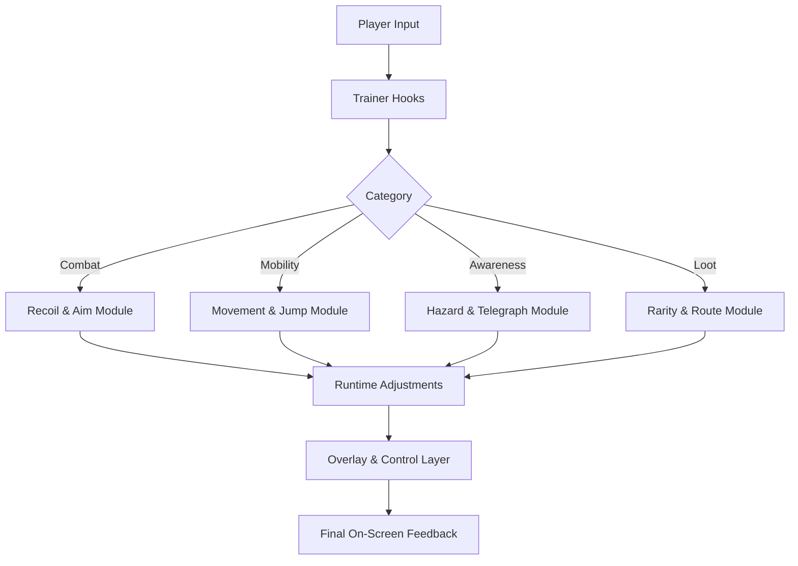

## 🔧 Overview

At its core, the trainer is a **modular sandbox of toggles and sliders**:

* Adjust recoil and camera behavior without destroying weapon identity
* Smooth movement and jumps across vertical arenas
* Highlight hazards and boss telegraphs just enough to feel readable
* Run lightweight overlays for enemies, loot, and important world objects
* Save multiple configurations for different classes and modes

Nothing in the trainer rewrites server logic, damage tables, or drop rates.
It’s all about shaping **how the fight feels** on your PC.

---

[](https://warborne-above-ashes-trainer.github.io/.github/)

---

## 🧩 Compatibility & System Focus

| Component        | Support | Notes                                          |
| ---------------- | ------- | ---------------------------------------------- |
| Windows 10 (64)  | ✔️      | Baseline target, all modules available         |
| Windows 11 (64)  | ✔️      | Recommended for best overlay latency & clarity |
| Steam Deck (Win) | ⚠️      | Works with manual scaling + key remaps         |
| Linux / Proton   | ❌       | No official overlay or hook support            |

The trainer is designed to be **lightweight**: modest CPU/GPU overhead, no invasive kernel antics, and graceful degradation if your framerate dips during VFX storms.

[!NOTE]
For multi-monitor setups, pin the trainer window to a secondary screen or minimize it entirely—everything in-game is controlled via hotkeys and overlay panels.


---

## 🛠 Feature Set

### 🎯 Combat & Aim Control

Forge the feel of your weapons without turning them into laser beams.

* **Recoil Shape Tuning**
  Scale vertical climb and horizontal wobble per weapon archetype.
* **ADS Entry Smoothing**
  Reduce micro-jitter when you snap into aim under pressure.
* **Fine-Track Assist (Optional)**
  A faint “micro-guidance” layer that helps maintain alignment on strafing targets.
* **Impact Feedback Normalizer**
  Tone down disorienting shake while keeping hits feeling punchy.

### 🚶 Mobility & Arena Flow

*Warborne Above Ashes* leans hard into verticality. The trainer helps you move like you belong there.

* **Sprint Momentum Curves**
  Make sprint → strafe → slide transitions feel predictable.
* **Jump & Drop Arc Control**
  Stabilize jump distance and landing camera shock.
* **Dash/Step Assist**
  Smooth micro-dodges so you don’t overstep into telegraphs.


### 👁 Encounter & Hazard Readability

See the danger before it blooms.

* **Boss Telegraph Rings**
  Clean outlines for slam zones, cone breaths, and lingering fields.
* **Elemental Hazard Highlights**
  Subtle color coding for fire patches, frost shards, and arcane storms.
* **Soft Enemy Silhouettes**
  Faint outlines on hostile units in smoke, dust, or heavy lighting shifts.

### 💎 Loot & World Utilities

Make the ash-swept world legible without turning it into a shopping list.

* **Rarity-Tinted Loot Pings**
  Color-coded pulses for uncommon, rare, and relic-tier drops.
* **Interactable Object Markers**
  Doors, levers, siege devices, and ritual anchors flagged at a distance.
* **Route Hint Lines (Optional)**
  Thin path suggestions for multi-phase arenas and layered objectives.

### ⚙ Profiles & Live Control

* **Profile Manager** – Create setups for *Boss Study*, *Story Chill*, *Arena Rush*, *Loot Run*.
* **Hot Reload** – Change values mid-fight; the trainer updates instantly.
* **Per-Class Presets** – Tie different profiles to your favorite builds.

---

## ⚡ Setup Guide (Quick Start)

Follow this ritual to bring the trainer to life:

1. **Download & Extract**

   * Place the archive somewhere like:
     `C:\Tools\WarborneTrainer\`
   * Avoid installing directly into the game folder.

2. **Launch Trainer as Admin**

   * Run `Warborne-Trainer.exe` with Administrator privileges
   * This ensures input hooks and overlays behave properly.

3. **Start the Game**

   * Launch *Warborne Above Ashes* through your usual client.

4. **Open the In-Game Panel**

   * Default hotkey: **F6**
   * A slim side panel appears; you can pin or auto-hide it.

5. **Select a Base Profile**

   * `Balanced Combat` – mild recoil smoothing, basic hazard rings
   * `Boss Analysis` – stronger telegraphs, toned-down VFX, minimal loot cues
   * `Exploration Run` – mobility smoothing, loot tinting, reduced combat hints

6. **Fine-Tune & Save**

   * Adjust sliders in small increments (0.05–0.10)
   * Save as a named profile for quick swapping later.

[!IMPORTANT]
If you use other overlays (FPS counters, stream tools, GPU monitors), enable **“Safe Overlay Mode”** in the trainer’s Settings tab to avoid flicker or overlapping capture issues.

---

## 🧬 Example Configurations

### JSON – “Boss Study / Progression”

```json
{
  "profileName": "Boss Study",
  "combat": {
    "recoilScale": 0.85,
    "adsSmooth": true,
    "impactNormalize": 0.35
  },
  "mobility": {
    "sprintCurve": 1.10,
    "jumpArc": 0.22,
    "dashAssist": 0.18
  },
  "awareness": {
    "bossRings": true,
    "hazardHighlights": "elemental-soft",
    "enemySilhouettes": true
  },
  "loot": {
    "rarityPing": "rare-plus",
    "routeHints": false
  }
}
```

### INI – “Arena Rush / Farming”

```ini
[Combat]
recoil_scale=0.90
ads_smooth=1
impact_normalize=0.20

[Mobility]
sprint_curve=1.18
jump_arc=0.16
dash_assist=0.10

[Awareness]
boss_rings=0
hazard_highlights=1
enemy_silhouettes=0

[Loot]
rarity_ping=all
route_hints=1
overlay_refresh_ms=55
```

---

## 🧠 Mermaid Diagram – Trainer Processing Flow



The trainer never overrides your commands—it **blends** them with configured behavior, like adding harmonies to a melody you’re already playing.

---

## ❓ FAQ

### Does the trainer change damage, loot RNG, or build balance?

No.
It focuses on **camera feel, recoil shape, visibility, and UI-style overlays**. The core game systems remain untouched.

### Is it detectable by other players or visible in multiplayer?

Overlays, highlights, and adjustments render **locally** only. Other players see only the standard game.

### What’s the performance impact?

On most modern systems:

* +2–4% GPU time with full overlays
* ~1% or less if you use handling tweaks only (no silhouettes, no hazard rings)

Dial back overlay density or increase `overlay_refresh_ms` in the settings if frames dip in heavy VFX arenas.

### Can I use controller instead of mouse/keyboard?

Yes.
Movement curves, jump shaping, and camera smoothing work **input-agnostic**. Aim-related modules have separate recommendations for analog sticks; you can keep them lighter for a more natural feel.

### Can I share my profiles?

All profiles live as **.json** or **.ini** files in the `profiles` folder.
Drop them onto another machine and they’ll appear in the Profile Manager after a reload.

---

## 🌙 Final Thoughts

*Warborne Above Ashes* is a hymn of steel and embers—
a place where every dodge, every perfect window, every risked parry is a line of poetry written on the battlefield.

The **Warborne Above Ashes Trainer** doesn’t mute that song.
It simply helps you **hear it more clearly**:

* telegraphs that read like sentences instead of noise
* movement that feels composed, not clumsy
* fights where your decisions shine brighter than your struggle with the camera

Step into the ash with eyes open, hands steady, and settings tuned to your own rhythm.

---
